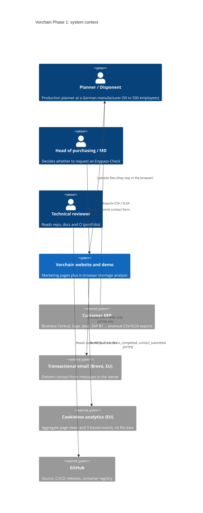
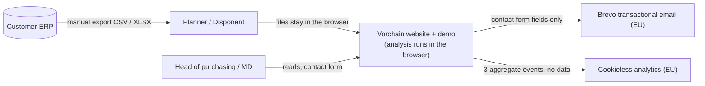
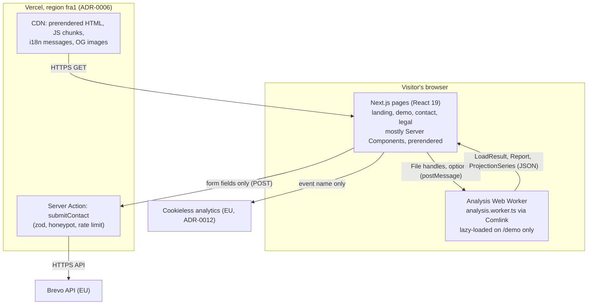
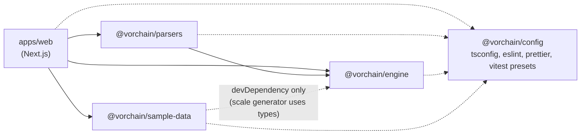
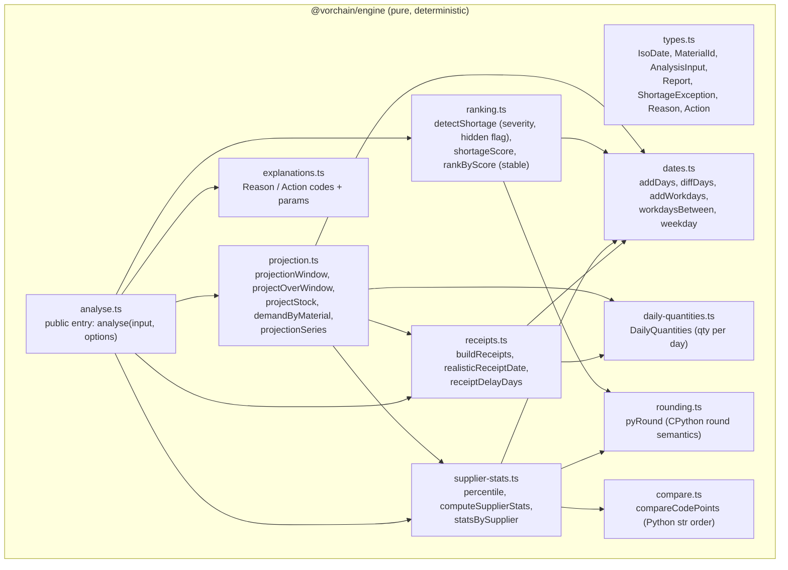
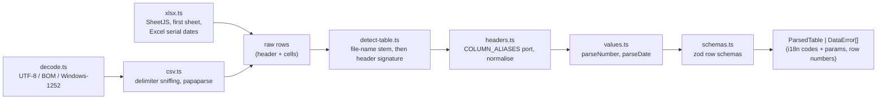
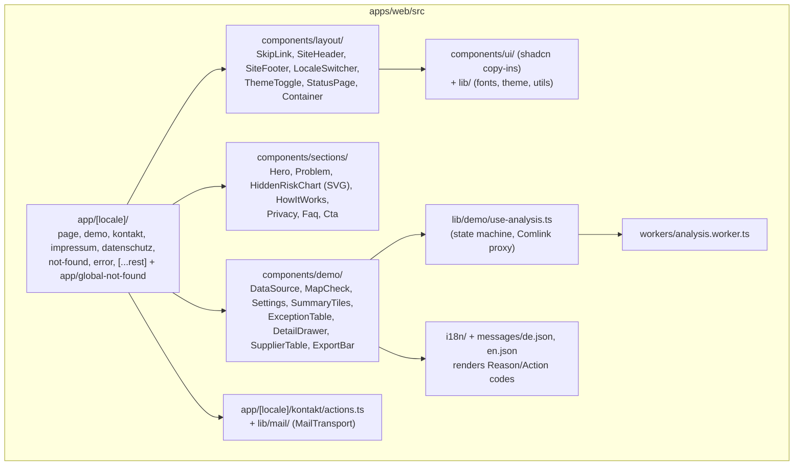
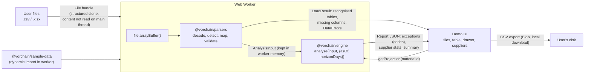
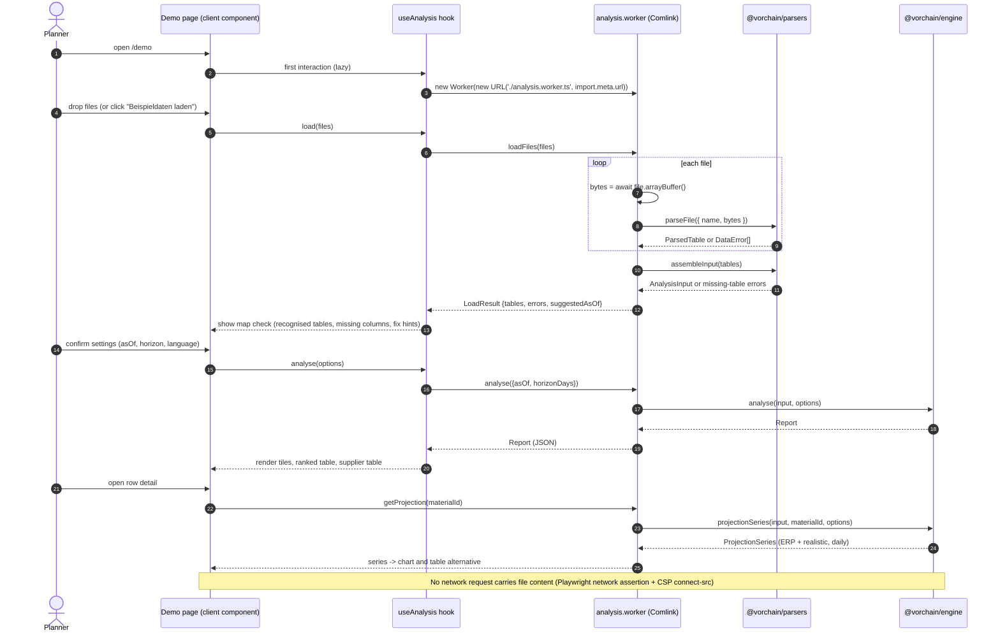
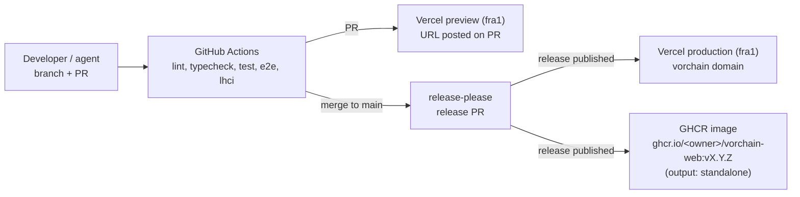

# Architecture: Vorchain Phase 1

Status: **target architecture for Phase 1**, planned 2026-09-25. Nothing below is built yet; the
backlog (`docs/backlog.md`) builds it step by step. Every PR that changes structure (new package,
new container, new external service, changed data flow) **must update this file in the same PR**.

Related: [glossary](glossary.md) (German ERP terms and code names) · [ADRs](../adr/) · [spec](../spec/phase-1-demo.md)

## 1. Architecture in one paragraph

Vorchain Phase 1 is a statically generated Next.js website with one interactive page (`/demo`).
Customer files are read, parsed and analysed **only inside a Web Worker in the visitor's browser**
([ADR-0003](../adr/0003-client-side-processing-in-web-worker.md)). The domain logic is a pure
TypeScript package (`@vorchain/engine`) that must reproduce the Python prototype exactly
([ADR-0005](../adr/0005-pure-engine-with-python-parity-tests.md)). The only server-side code is the
contact-form Server Action ([ADR-0007](../adr/0007-contact-form-delivery.md)). The site is hosted on
Vercel in the Frankfurt region, with a portable Docker image as the exit path
([ADR-0006](../adr/0006-hosting-and-deployment-target.md)).

## 2. C4 Level 1: System context



If the C4 renderer lays this out poorly on GitHub, the same content as a flowchart:



## 3. C4 Level 2: Containers



Security boundary: the browser's CSP `connect-src` allows only `'self'` and the analytics origin, so
even a bug in our code cannot post file contents to a third party. The e2e network test proves no
request carries file content (ADR-0003, ADR-0008).

## 4. C4 Level 3: Components

### 4.1 Packages and dependency rule



Rules (enforced by `eslint-plugin-boundaries` from Task 0 on):
- `engine` imports nothing internal and no platform APIs (no DOM, no Node built-ins, no `Date.now()`).
- `parsers` imports only `engine` (for domain types) plus `papaparse`, `xlsx`, `zod`. It takes
  `{ name, bytes }`, never a DOM `File`, so it also runs in Node (tests, Phase 2 backend).
- `apps/web` is the only package that knows about React, Next.js, i18n and the Worker.

### 4.2 Engine components (`packages/engine`)



### 4.3 Parser components (`packages/parsers`)



### 4.4 Web app components (`apps/web`)



## 5. Data flow of the demo



What crosses the worker boundary back to the page is derived data only (IDs, dates, numbers, codes).
The page never receives raw rows and nothing is ever sent to the network.

## 6. Sequence: upload and analyse



## 7. Engine public API (contract for builder)

The engine API is JSON-in / JSON-out so the same contract can back a Phase 2 service. The types
below are defined in `packages/engine/src/types.ts` (P1-01) with TSDoc on every field; this is a
condensed view (all fields are `readonly` in code). Update this section when the contract changes.

```ts
type IsoDate = Brand<string, 'IsoDate'>;        // 'YYYY-MM-DD', years 0001..9999, no time zone
type MaterialId = Brand<string, 'MaterialId'>;  // likewise SupplierId, PoId (compile-time brand only)
type Result<T, E> = { ok: true; value: T } | { ok: false; error: E };

interface Material {
  materialId: MaterialId; description: string; mainSupplierId: SupplierId | null;
  onHand: number; safetyStock: number /* 0 if missing */; unit: string | null;
}
interface PurchaseOrder { poId: PoId; materialId: MaterialId; supplierId: SupplierId; qty: number; promisedDate: IsoDate }
interface DemandLine { materialId: MaterialId; date: IsoDate; qty: number }
interface DeliveryRecord { supplierId: SupplierId; promisedDate: IsoDate | null; actualDate: IsoDate | null; poId: PoId | null }
interface Supplier { supplierId: SupplierId; name: string }

interface AnalysisInput {
  materials: Material[];                 // file order matters (tie-break in ranking)
  openPurchaseOrders: PurchaseOrder[];
  demand: DemandLine[];
  supplierHistory: DeliveryRecord[];     // promisedDate / actualDate may be null (skipped)
  suppliers: Supplier[];                 // optional table, may be empty
}
interface AnalysisOptions { asOf: IsoDate; horizonDays: number; minReliableDeliveries?: number /* 3 */ }

function analyse(input: AnalysisInput, options: AnalysisOptions): Report;
function projectionSeries(input: AnalysisInput, materialId: MaterialId, options: AnalysisOptions): ProjectionSeries;

interface Report {
  asOf: IsoDate; horizonDays: number;
  summary: { critical: number; warning: number; hidden: number;
             overduePurchaseOrders: number };  // option B: overduePurchaseOrders.length
  exceptions: ShortageException[];       // sorted by score desc, stable
  supplierStats: SupplierStats[];         // order of first complete history row (prototype dict order)
  overduePurchaseOrders: OverduePurchaseOrder[];  // option B (ADR-0005 item 5), PO-file order
}
interface ShortageException {
  materialId: MaterialId; description: string; mainSupplierId: SupplierId | null;
  severity: 'CRITICAL' | 'WARNING';
  criticalDate: IsoDate; erpViewDate: IsoDate | null; daysUntil: number;
  minProjectedStock: number;             // pyRound(x)
  safetyStock: number;                   // pyRound(x), display only (prototype safety_stock)
  hidden: boolean; score: number;        // pyRound(x, 1)
  reasons: Reason[]; actions: Action[];  // codes + params, never display text
}
type Reason =
  | { code: 'NO_OPEN_PO' }
  | { code: 'PO_AFTER_CRITICAL'; poId: PoId; promisedDate: IsoDate }
  | { code: 'PO_LATE'; poId: PoId; promisedDate: IsoDate; supplierId: SupplierId; delayDays: number;
      onTimeRate: number; lowConfidence: boolean; deliveries: number }
  | { code: 'HIDDEN_ERP_LATER'; erpViewDate: IsoDate }
  | { code: 'HIDDEN_ERP_NONE' }
  | { code: 'PO_OVERDUE'; poId: PoId; promisedDate: IsoDate; supplierId: SupplierId;
      realisticDate: IsoDate };          // option B, after the prototype's reasons
type Action =
  | { code: 'PLACE_ORDER'; supplierId: SupplierId | null }
  | { code: 'PULL_FORWARD'; supplierId: SupplierId; poId: PoId; before: IsoDate }
  | { code: 'EXPEDITE'; poId: PoId; before: IsoDate }
  | { code: 'REVIEW_QTY_OR_DEMAND' };
type ReasonCode = Reason['code']; type ActionCode = Action['code'];

interface OverduePurchaseOrder {          // open PO with promisedDate < asOf (not in the prototype)
  poId: PoId; materialId: MaterialId; supplierId: SupplierId; qty: number; promisedDate: IsoDate;
  realisticDate: IsoDate;                // addWorkdays(promisedDate, p80)
  countedInRealisticView: boolean;       // realisticDate in [asOf, asOf + horizonDays)
  hasException: boolean;                 // the material has an exception in this report
}

interface SupplierStats {                // prototype: mean, p80, on_time_rate, n, reliable_stats
  supplierId: SupplierId; meanDelayDays: number; p80DelayDays: number;
  onTimeRate: number; deliveries: number; reliable: boolean;
}
interface ProjectionSeries {
  materialId: MaterialId; safetyStock: number;
  points: { date: IsoDate; demand: number; erpReceipts: number; realisticReceipts: number;
            erpStock: number; realisticStock: number }[];   // one per day of [asOf, asOf + horizon)
}
```

Helpers exported since P1-01 (`dates.ts`, `rounding.ts`, `result.ts`): `parseIsoDate`,
`isoDateFromParts`, `addDays`, `diffDays`, `weekday` (Mon = 0), `isWorkday`, `addWorkdays`,
`workdaysBetween`, `pyRound(x, ndigits?)`, `ok`, `err`, and the ID brands `materialId`,
`supplierId`, `poId`. Since P1-02: `percentile`, `computeSupplierStats`, `statsBySupplier`.

Building blocks exported since P1-03 (used by `analyse` in P1-04 and the explanations in P1-05):

```ts
type DailyQuantities = ReadonlyMap<IsoDate, number>;   // qty per day, first-appearance order
interface ReceiptSchedule { erp: DailyQuantities; realistic: DailyQuantities }
function receiptDelayDays(supplierId: SupplierId, stats: SupplierStatsMap): number; // p80 or 0
function realisticReceiptDate(po: PurchaseOrder, stats: SupplierStatsMap): IsoDate;
function buildReceipts(pos: PurchaseOrder[], stats: SupplierStatsMap): ReadonlyMap<MaterialId, ReceiptSchedule>;
function demandByMaterial(demand: DemandLine[]): ReadonlyMap<MaterialId, DailyQuantities>;
function projectStock(input: { onHand; demandByDay; receiptsByDay; asOf; horizonDays; safetyStock }):
  { firstStockOut: IsoDate | null; firstBelowSafety: IsoDate | null; minStock: number };
```

Since P1-04: `analyse` and its building blocks in `ranking.ts`. Internally, `analyse` builds the
projection window once per run (`projectionWindow`) and projects every material in both views over
it (`projectOverWindow`); rebuilding it per projection cost ~90 % of the run time at 20k materials.

```ts
interface ShortageFinding { severity: Severity; criticalDate: IsoDate; erpViewDate: IsoDate | null; hidden: boolean }
function detectShortage(erp: StockProjection, realistic: StockProjection): ShortageFinding | null;
function shortageScore(f: { horizonDays; daysUntil; safetyStock; minStock; hidden; severity }): number; // pyRound(x, 1)
function rankByScore<T extends { score: number }>(items: readonly T[]): T[];  // stable, score desc
```

Since P1-05: structured explanations in `explanations.ts` and overdue POs in `overdue.ts`.

```ts
function explainShortage(c: { mainSupplierId; purchaseOrders /* material's, PO-file order */;
  stats: SupplierStatsMap; finding: ShortageFinding }): { reasons: Reason[]; actions: Action[] };
const REASON_CODES: readonly ReasonCode[]; const ACTION_CODES: readonly ActionCode[];
function explanationPoId(entry: Reason | Action): PoId | null;   // exhaustive switch
function findOverduePurchaseOrders(pos, stats, { asOf, horizonDays }, flagged): OverduePurchaseOrder[];
function overdueReasons(pos, stats, asOf): Reason[];              // one PO_OVERDUE per overdue PO
```

Rules, in the prototype's order (ADR-0005 item 8): no open PO -> `NO_OPEN_PO` + `PLACE_ORDER`
(main supplier or `null`); per PO in file order: `promised >= criticalDate` -> `PO_AFTER_CRITICAL`
+ `PULL_FORWARD`, else P80 delay > 0 -> `PO_LATE` (+ `EXPEDITE` if `promised + p80 >= criticalDate`);
hidden -> `HIDDEN_ERP_LATER` / `HIDDEN_ERP_NONE`; no action yet -> `REVIEW_QTY_OR_DEMAND`, so every
exception has at least one action. Then `analyse` appends one `PO_OVERDUE` per overdue PO of the
material.

Supplier names are resolved in the UI (`suppliers` table), not in the engine, so the engine output
stays free of display text.

Known parity quirk (ADR-0005 item 5, backlog Q4): the projection window drops receipts dated
before `asOf`. An overdue PO therefore never arrives in the ERP view, but its realistic date
(`promised + p80`) can fall inside the window, so the realistic view can look *less* alarming than
the ERP view, and a material with an ERP-only stock-out is skipped from the report. Kept for
parity. The owner chose option B on 2026-09-29: `Report.overduePurchaseOrders`,
`summary.overduePurchaseOrders` and the `PO_OVERDUE` reason make overdue POs visible without
changing any number (ADR-0005 item 5); the demo shows the note in P1-17.

## 8. Deployment view



## 9. Phase 2 outlook (designed for, not built)

- A backend (FastAPI or Spring Boot, or Node reusing `@vorchain/engine` directly) runs the same
  algorithm on scheduled imports. The golden JSON files are the shared contract: any port must pass
  the same parity tests.
- `@vorchain/parsers` takes bytes, not DOM `File`s, so a Node service can reuse it unchanged.
- `Report` is JSON-serialisable and contains no display strings, so it can be stored, emailed
  (weekly report) and rendered by any client.
- Hosting: the GHCR image means the web app can move to an EU container host next to the backend
  without a rewrite (ADR-0006).
- Nothing in Phase 1 stores customer data server-side, so Phase 2 needs its own data-protection
  design (DPA, retention, encryption) and its own ADRs.
