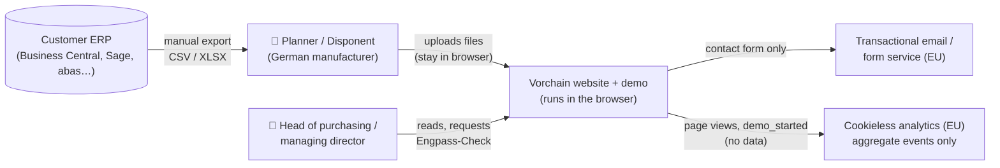
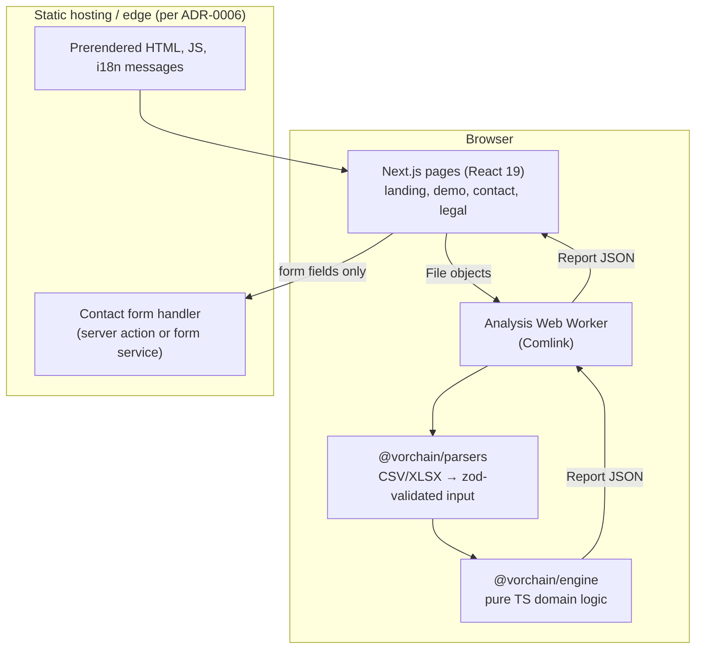
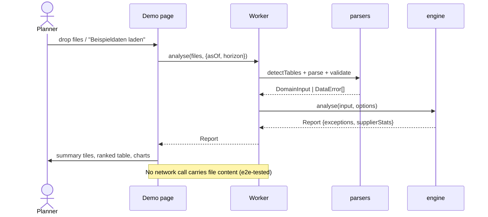
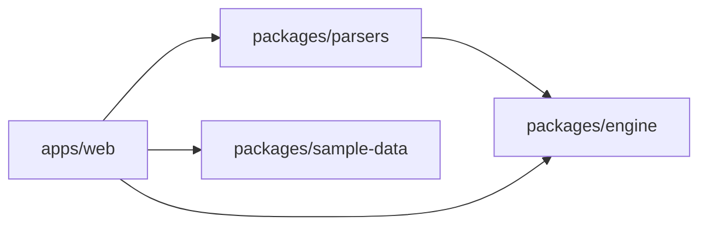

# Architecture (initial draft, to be refined by the `architect` agent)

## C4 Level 1: System context

## C4 Level 2: Containers (Phase 1)

## Demo data flow

## Module dependency rule

## Phase 2 outlook (not built now)
Backend service (FastAPI or Spring Boot) calls the same algorithm on scheduled imports. The engine's JSON-in/JSON-out API is designed so it can be reused, or ported with the same golden parity tests.
