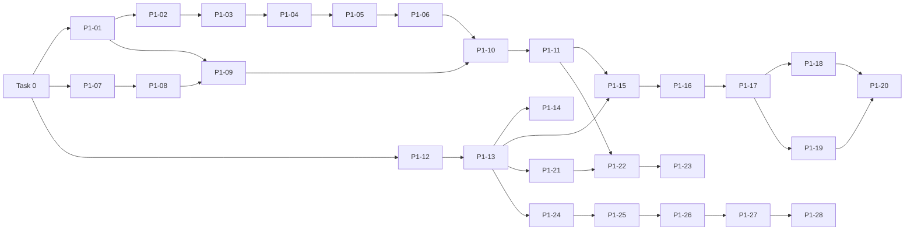

# Backlog: Phase 1 (website + in-browser demo)

Planned 2026-09-25 by the architect agent. Source: `docs/spec/phase-1-demo.md`, `AGENTS.md`,
ADRs 0001 to 0012, `docs/architecture/README.md`.

## How to use this backlog
- Work **top to bottom**. One task = one branch = one PR (squash-merged; the PR title is the
  Conventional Commit, ADR-0009). Link the task ID in the PR description.
- Size rule: <= 1 day and <= ~400 changed lines (lockfile and generated files excluded). If a task
  grows beyond that, split it and add `P1-xxb` below it instead of growing the PR.
- **Definition of Done** (AGENTS.md §8) applies to every task in addition to its acceptance
  criteria: `pnpm lint && pnpm typecheck && pnpm test && pnpm build` green (+ `pnpm test:e2e` if UI
  changed), i18n keys in `de` and `en`, docs/diagrams updated **in the same PR** when structure
  changes, CI green.
- Tick the box when the task is merged. `qa` verifies each task after `builder`/`devops` finish.
- Owner agent: `devops` for tooling/CI/deploy tasks, `builder` for everything else.

## Overview

| ID | Title | Owner | Depends on |
|---|---|---|---|
| Task 0 | Repo bootstrap: workspaces, tooling, CI skeleton | devops | - |
| P1-01 | Engine: domain types, date-only helpers, Python-compatible rounding | builder | Task 0 |
| P1-02 | Engine: supplier delay statistics | builder | P1-01 |
| P1-03 | Engine: receipts and day-by-day stock projection | builder | P1-02 |
| P1-04 | Engine: exception detection, severity, hidden flag, score, ranking | builder | P1-03 |
| P1-05 | Engine: structured explanations (reason and action codes) | builder | P1-04 |
| P1-06 | Engine: parity test against Python golden files + property tests + coverage gate | builder | P1-05 |
| P1-07 | Parsers: byte decoding, delimiter sniffing, CSV reading | builder | Task 0 |
| P1-08 | Parsers: German/English number and date parsing | builder | P1-07 |
| P1-09 | Parsers: header aliases, table detection, row validation, input assembly | builder | P1-08, P1-01 |
| P1-10 | Parsers: XLSX support and end-to-end parity (parsers -> engine) | builder | P1-09, P1-06 |
| P1-11 | Sample-data package: bundled datasets and seeded scale generator | builder | P1-10 |
| P1-12 | Web: next-intl routing, route stubs, static generation | builder | Task 0 |
| P1-13 | Web: design tokens, fonts, layout, dark mode, 404 and error pages | builder | P1-12 |
| P1-14 | CD: preview deploy per PR + release-please | devops | P1-13 |
| P1-15 | Web: analysis Web Worker bridge (Comlink) and `useAnalysis` hook | builder | P1-11, P1-13 |
| P1-16 | Demo: data source (sample / upload) and map check | builder | P1-15 |
| P1-17 | Demo: settings, summary tiles, ranked exception table | builder | P1-16 |
| P1-18 | Demo: row detail drawer with projection chart and table alternative | builder | P1-17 |
| P1-19 | Demo: supplier reliability table, CSV export, printable report | builder | P1-17 |
| P1-20 | Demo: e2e suite (privacy network assertion, XLSX, errors, cross-browser, axe) | builder | P1-18, P1-19 |
| P1-21 | Landing page: sections and content | builder | P1-13 |
| P1-22 | Landing page: hidden-risk chart (build-time engine data, SVG) | builder | P1-21, P1-11 |
| P1-23 | SEO: metadata, sitemap, robots, hreflang, JSON-LD, OG images | builder | P1-22 |
| P1-24 | Legal pages: Impressum and Datenschutz (owner placeholders) | builder | P1-13 |
| P1-25 | Contact form: Server Action, validation, spam protection, mail transport | builder | P1-24 |
| P1-26 | Cookieless analytics for three funnel events | builder | P1-25 |
| P1-27 | Hardening: security headers/CSP, Lighthouse CI, a11y on all pages, bundle budget | devops | P1-26 |
| P1-28 | Production deploy on release, GHCR image, domain, runbooks | devops | P1-27 |

The engine track (P1-01..06) and the parser track (P1-07..08) can run in parallel after Task 0,
and P1-12/13 can run in parallel with both. The linear order below is the recommended single-agent
order.

---

## Task 0: Repo bootstrap: workspaces, tooling, CI skeleton
- [x] Done
- **Owner:** devops
- **Why:** every later task relies on the same commands, strict TypeScript, lint boundaries,
  hooks and CI. Doing this once, first, keeps feature PRs small (ADR-0002, 0008, 0009, 0010).
- **Acceptance criteria:**
  1. Root `package.json` with `"packageManager": "pnpm@12.6.0"`, `"engines": { "node": ">=24 <25" }`,
     `private: true`; `.nvmrc` = `24`; `.npmrc` with `engine-strict=true`; `pnpm-workspace.yaml`
     with `apps/*` and `packages/*`; `.editorconfig`; `.env.example` (keys only, no values).
  2. Packages exist with `package.json`, `tsconfig.json`, `src/index.ts` and one passing test each:
     `packages/engine`, `packages/parsers`, `packages/sample-data`, `packages/config`
     (`tsconfig.base.json`, ESLint flat config, Prettier config, Vitest preset). Internal packages
     are consumed as TS source (ADR-0002).
  3. `apps/web`: minimal Next.js 16 App Router app (React 19, TypeScript, `output: 'standalone'`,
     `transpilePackages` for internal packages) rendering a placeholder page with one `h1`.
     No i18n, Tailwind or shadcn yet (P1-12/13).
  4. Versions per ADR-0010: `typescript@~6.0.3`, `eslint@^9.39`, `typescript-eslint@8`,
     `eslint-config-next@16`, `eslint-plugin-jsx-a11y@6`, `eslint-plugin-boundaries@7`, `prettier@3`.
     `tsconfig.base.json` has `strict`, `noUncheckedIndexedAccess`, `exactOptionalPropertyTypes`,
     `verbatimModuleSyntax`; engine uses `lib: ["ES2023"]` and `types: []` (no DOM, no Node).
  5. Boundary rule works: importing `react` or `@vorchain/parsers` from `packages/engine/src`, or
     `@vorchain/web` from any package, makes `pnpm lint` fail (demonstrate in the PR description,
     do not commit the violation).
  6. `turbo.json` with `build`, `lint`, `typecheck`, `test`, `coverage`, `test:e2e` (build depends on
     `^build`; caching outputs declared). Root scripts: `dev build lint typecheck test test:e2e
     coverage format format:check lhci` (`lhci` may be a stub that exits 0 with a message pointing
     to P1-27).
  7. Vitest 5 + `@vitest/coverage-v8` configured via the shared preset; coverage thresholds wired
     per package (engine 95, parsers 90, web 80) and passing on the placeholder code.
  8. Playwright configured in `apps/web` (`e2e/`, Chromium project, `webServer` runs the production
     build) with one smoke test: `/` returns 200 and has exactly one `h1`.
  9. lefthook: `pre-commit` runs Prettier (write) and ESLint on staged files; `commit-msg` runs
     commitlint with the types and scopes from AGENTS.md §7. Installed automatically via `prepare`.
  10. CI `.github/workflows/ci.yml` on `pull_request` and push to `main`: pnpm + Node 24 setup with
      cache, jobs `lint`, `typecheck`, `test` (with coverage), `build`, `e2e` (Playwright browsers
      cached), PR-title commitlint check; `concurrency` cancels superseded runs; `permissions:
      contents: read` by default.
  11. Security basics: `.github/dependabot.yml` (npm weekly, grouped; github-actions monthly),
      `.github/workflows/codeql.yml` (javascript-typescript), gitleaks job in CI,
      `pnpm audit --prod --audit-level=high` job (non-blocking allowed for now, documented).
  12. `.github/pull_request_template.md` (What / Why / How tested / Screenshots / Checklist incl.
      "Task ID", "ADR added if a decision was made", "Diagrams updated if structure changed"),
      `.github/CODEOWNERS`.
  13. `README.md`: CI and CodeQL badges, quick start (`nvm use`, `corepack enable`, `pnpm i`,
      `pnpm dev`), command table; the architecture/docs table stays and links `docs/backlog.md`.
- **Test plan:** fresh clone -> `pnpm i && pnpm lint && pnpm typecheck && pnpm test && pnpm build
  && pnpm test:e2e` all green locally; push branch, open PR, all CI jobs green; make a commit with
  message `bad message` and confirm lefthook rejects it; temporary boundary violation fails lint.
- **Packages:** root, `apps/web`, `packages/*`, `.github/`
- **Branch:** `chore/repo-bootstrap`
- **Commits (may be several PRs if > ~400 hand-written lines):**
  - `build: set up pnpm workspace and turborepo`
  - `build(deps): add shared typescript, eslint, prettier and vitest config`
  - `chore: add minimal next.js app and package skeletons`
  - `test: add vitest and playwright smoke tests`
  - `chore: add lefthook and commitlint`
  - `ci: add ci workflow with lint, typecheck, test, build and e2e`
  - `ci: add dependabot, codeql and gitleaks`
  - `docs: add readme badges and quick start`
- **Notes for devops:** the dev machine's `~/.bash_profile` still sets
  `NPM_CONFIG_REGISTRY=https://registry.npm.taobao.org` and `NPM_CONFIG_STRICT_SSL=false`
  (`docs/runbooks/dev-machine-setup.md`). Environment variables override `.npmrc`, so ask the owner
  to remove them before the first `pnpm install`. Use `/usr/local/bin/git`. Branch protection on
  `main` (required checks, linear history, squash only) is a manual GitHub setting: list it for the
  owner.

---

## P1-01: Engine: domain types, date-only helpers, Python-compatible rounding
- [x] Done
- **Owner:** builder
- **Why:** every engine rule depends on exact calendar arithmetic and on rounding identical to
  CPython; getting these wrong breaks parity silently (ADR-0005 items 1, 4).
- **Acceptance criteria:**
  1. `IsoDate`, `MaterialId`, `SupplierId`, `PoId` branded types; `parseIsoDate(s): Result<IsoDate, DateError>`
     accepts only real calendar dates in `YYYY-MM-DD` (rejects `2026-02-30`, `2026-1-5`).
  2. `addDays`, `diffDays` (calendar), `weekday` (Mon = 0 like Python), `addWorkdays(d, n)`,
     `workdaysBetween(a, b)` behave exactly like `shortage_radar.py` including weekend start/end
     dates, negative `n`, month/year boundaries and leap days; implemented with UTC arithmetic only.
  3. `pyRound(x, ndigits = 0)` reproduces CPython `round()` for all vectors in ADR-0005 item 1 plus
     negative values and `-0`.
  4. `Result<T, E>` type with `ok()`/`err()` helpers.
  5. Public types from architecture §7 (`AnalysisInput`, `AnalysisOptions`, `Report`,
     `ShortageException`, `Reason`, `Action`, `SupplierStats`, `ProjectionSeries`) exported from
     `@vorchain/engine` with TSDoc (types only; functions come in later tasks).
  6. No imports of DOM/Node/React; `Date` used only via UTC helpers inside `dates.ts`.
- **Test plan:** table-driven Vitest tests for each helper including the Python test cases
  (`add_workdays(Fri, 1) = Mon`, `workdays_between(Fri, Mon) = 1`, reverse = -1), weekend-to-weekend
  pairs, year boundary 2026-12-31 -> 2027-01-04, leap day 2028-02-29; rounding vectors; fast-check:
  `workdaysBetween(a, addWorkdays(a, n)) === n` for weekday `a`, `diffDays(a, addDays(a, n)) === n`.
  100 % coverage for `dates.ts` and `rounding.ts`.
- **Packages:** `packages/engine`
- **Branch:** `feat/engine-domain-types`
- **Commits:**
  - `feat(engine): add date-only type and working-day helpers`
  - `feat(engine): add python-compatible rounding helper`
  - `feat(engine): define analysis input and report types`

---

## P1-02: Engine: supplier delay statistics
- [x] Done
- **Owner:** builder
- **Why:** the realistic view shifts each PO by its supplier's P80 delay; on-time rate and
  low-confidence flags feed explanations and the supplier table (spec §5.2 step 1).
- **Acceptance criteria:**
  1. `percentile(values, p)` matches the prototype (numeric sort, `k = (n-1)p`, linear
     interpolation; empty -> 0).
  2. `computeSupplierStats(history, { minReliableDeliveries = 3 })` returns `SupplierStats[]`
     (`supplierId`, `mean`, `p80 = max(0, pyRound(percentile(delays, 0.8)))`, `onTimeRate` (delay
     <= 0), `deliveries`, `reliable`) in order of first appearance (the prototype's dict order).
  3. Rows with a missing `promisedDate` or `actualDate` are skipped.
  4. A lookup helper `statsBySupplier(stats)` returns a `Map` for O(1) access.
- **Test plan:** table tests: all on time -> p80 0, rate 1; delays `[0,1,2,3,10]` -> p80 4;
  early deliveries (negative delays) -> p80 clamped to 0; half-way rounding case where P80 is exactly
  `x.5` (ties to even); 2 deliveries -> `reliable: false`; skipped rows. fast-check: `0 <= onTimeRate <= 1`,
  `p80 >= 0`, values per supplier independent of history row order.
- **Packages:** `packages/engine`
- **Branch:** `feat/engine-supplier-stats`
- **Commits:** `feat(engine): compute supplier delay statistics with p80 and on-time rate`
- **Note (P1-02):** suppliers keep the order of their first complete history row, as AC 2 says
  (the owner chose this over sorting by `supplierId`). The golden files sort by `supplierId`, so
  the P1-06 parity test sorts with `compareCodePoints` before comparing. Field names
  follow the architecture §7 contract (`meanDelayDays`, `p80DelayDays`), not the draft's
  `mean`/`p80`. An exact `x.5` P80 cannot occur with whole-day delays (`(n - 1) * 0.8` has
  fractions of 0.2), so the tie case is tested on `percentile` with `p = 0.5` plus a property.

---

## P1-03: Engine: receipts and day-by-day stock projection
- [x] Done
- **Owner:** builder
- **Why:** the core of the product: project stock twice (ERP view vs realistic view)
  (spec §5.2 steps 2 to 4).
- **Acceptance criteria:**
  1. `buildReceipts(purchaseOrders, statsMap)` returns, per material, ERP receipts (promised date)
     and realistic receipts (`addWorkdays(promised, p80)`, 0 for unknown suppliers), quantities
     summed per day.
  2. `projectStock({ onHand, demandByDay, receiptsByDay, asOf, horizonDays, safetyStock })` returns
     `{ firstStockOut, firstBelowSafety, minStock }` iterating `[asOf, asOf + horizon)`: receipts
     first, then demand; strict `<` comparisons; `minStock` starts at `onHand`.
  3. Receipts or demand dated before `asOf` or on/after `asOf + horizon` are ignored (ADR-0005 item 5).
  4. `projectionSeries(input, materialId, options)` returns daily points
     `{ date, demand, erpReceipts, realisticReceipts, erpStock, realisticStock }` plus `safetyStock`
     for the chart (P1-18, P1-22).
- **Test plan:** port of the Python scenario (as-of Mon 2026-10-05, 100 on hand, safety 0, 20/day
  on weekdays, PO 200 promised Fri 2026-10-09, supplier history always 3 working days late, horizon
  10). Hand-computed expectations: realistic receipt Wed 2026-10-14; ERP view: no stock-out, min 20;
  realistic view: stock hits exactly 0 on Fri 2026-10-09 (not a stock-out, strict `<`), first
  stock-out Mon 2026-10-12, min -40. (P1-04 will then assert `daysUntil` 7 and score 79 =
  9 + 30 + 15 + 25.) Plus: receipt before `asOf` ignored; demand on the last horizon day counted,
  demand on day `horizon` not counted; stock exactly equal to safety stock is not "below".
  fast-check: adding a receipt never makes `firstStockOut` earlier; `minStock <= onHand`.
- **Packages:** `packages/engine`
- **Branch:** `feat/engine-projection`
- **Commits:**
  - `feat(engine): build erp and realistic receipt schedules`
  - `feat(engine): project stock day by day over the horizon`
- **Note (P1-03):** besides the AC functions, the engine exports the building blocks P1-04/P1-05
  need: `receiptDelayDays` (P80 or 0), `realisticReceiptDate`, `demandByMaterial` and the
  `DailyQuantities` / `ReceiptSchedule` types. Suppliers with too little history are still shifted
  by their P80, as in the prototype. A negative horizon projects no day (Python `range`); a
  fractional one throws. `projectionSeries` uses the first row of a duplicated material and throws
  `RangeError` for an unknown one. Parity: `python-vectors.test.ts` replays 150 direct `project`
  calls and every `project` call `analyse` makes on `sample_data` and 40 random datasets
  (`sample_data_de` loads to the same input; the generator asserts that instead of storing it).

---

## P1-04: Engine: exception detection, severity, hidden flag, score, ranking
- [x] Done
- **Owner:** builder
- **Why:** turns projections into the ranked list a planner acts on (spec §5.2 steps 5 to 8).
- **Acceptance criteria:**
  1. `analyse(input, options): Report` skips materials without realistic stock-out or
     below-safety day; `severity`, `criticalDate`, `erpViewDate` (same kind), `daysUntil`
     (calendar), `hidden`, `minProjectedStock = pyRound(min)`, `safetyStock`, `score =
     pyRound(formula, 1)` using the unrounded min stock.
  2. Exceptions sorted by score descending with a stable sort (ties keep materials order).
  3. `summary` counts critical, warning and hidden.
  4. `supplierStats` included in the report. `reasons`/`actions` are empty arrays until P1-05.
  5. Input is not mutated (verified with a frozen deep copy in tests).
- **Test plan:** Python `test_reliable_supplier_no_alert` -> empty; `test_late_supplier_creates_hidden_risk`
  -> 1 CRITICAL, hidden, `erpViewDate: null`; WARNING-only case; hidden because ERP date later;
  not hidden because same date; score formula table (each term isolated); tie-order test with two
  equal scores. fast-check: `CRITICAL => minProjectedStock < 0`; output is sorted by score;
  every exception's `daysUntil` in `[0, horizon)`.
- **Packages:** `packages/engine`
- **Branch:** `feat/engine-ranking`
- **Commits:** `feat(engine): detect, score and rank shortage exceptions`
- **Note (P1-04):** `ranking.ts` exports `detectShortage` (severity, dates, hidden flag),
  `shortageScore` and `rankByScore`; `analyse.ts` wires them up. The CRITICAL property holds as
  `minProjectedStock < 0` only for whole quantities: with fractional ones `pyRound(-0.4)` is `0`,
  so the property test checks `<= 0` there (as the prototype does). An overdue PO can make the ERP
  view look worse than the realistic view; the prototype then raises no exception, and neither do
  we (ADR-0005 item 5). Since P1-05 (option B) such a PO is listed in
  `Report.overduePurchaseOrders` (`hasException: false`), without changing any number.
  Performance (P1-03 QA finding): `projectionWindow` builds the window once per run and
  `projectOverWindow` reuses it; 20k materials, 100k demand rows, 30k POs, 90 days went from
  ~3.6 s to ~0.35 s. `analyse.perf.test.ts` guards this with a call-count check and a 3 s
  timeout. Parity: `python-vectors.test.ts` compares the ranked exceptions with the prototype's
  `analyse` on `sample_data`, the 40 P1-03 datasets and 40 ranking-shaped datasets.

---

## P1-05: Engine: structured explanations (reason and action codes)
- [x] Done
- **Owner:** builder
- **Why:** explainability is a core principle; the engine returns codes + params, the UI renders
  them per locale (spec §5.2 step 9, AGENTS.md §2.3).
- **Acceptance criteria:**
  1. Rules in prototype order, POs iterated in PO-file order: no open PO -> `NO_OPEN_PO` +
     `PLACE_ORDER { supplierId: mainSupplierId | null }`; promised >= critical ->
     `PO_AFTER_CRITICAL` + `PULL_FORWARD { before: criticalDate }`; else if delay > 0 -> `PO_LATE`
     (with `onTimeRate`, `deliveries`, `lowConfidence = !reliable`) and, if realistic date >=
     critical, `EXPEDITE { before: criticalDate }`; hidden -> `HIDDEN_ERP_LATER { erpViewDate }` or
     `HIDDEN_ERP_NONE`; no action so far -> `REVIEW_QTY_OR_DEMAND`.
  2. `Reason`/`Action` are discriminated unions; exhaustive `switch` helpers compile-fail on a
     missing case (`satisfies never`).
  3. No display strings anywhere in the engine (lint or test asserts no German/English prose in
     `src/`, e.g. a simple check that `explanations.ts` exports no string literals besides codes).
- **Test plan:** one table test per rule and per combination (late + expedite, late but realistic
  before critical -> no expedite, PO after critical beyond horizon, unknown main supplier, low
  confidence with 2 deliveries). Compare with the prototype's English text for the sample data by
  mapping codes to the prototype's `TXT['en']` strings in a test helper (catches rule-order bugs).
- **Packages:** `packages/engine`
- **Branch:** `feat/engine-explanations`
- **Commits:** `feat(engine): add structured reasons and next actions to exceptions`
- **Note (P1-05):** `explanations.ts` exports `explainShortage`, `REASON_CODES`, `ACTION_CODES`
  and `explanationPoId` (exhaustive `switch`). Parity: a test helper renders the codes with the
  prototype's `TXT['en']` templates and `python-vectors.test.ts` compares them with the prototype's
  `why` / `next_action` strings on all 195 exceptions of the vector datasets (sample data, 40
  random, 40 ranking-shaped, the ADR-0005 example). **Owner decision 2026-09-29 on overdue POs
  (ADR-0005 item 5, Q4): option B**, implemented here in `overdue.ts`: `Report.overduePurchaseOrders`
  (open POs with `promisedDate < asOf`: `poId`, `materialId`, `supplierId`, `qty`, `promisedDate`,
  `realisticDate`, `countedInRealisticView`, `hasException`), `summary.overduePurchaseOrders` and a
  `PO_OVERDUE` reason appended after the prototype's reasons. No number, severity, score, order or
  prototype reason/action changes; the parity comparison skips `PO_OVERDUE` explicitly, and the
  overdue list is checked against python3 values computed from the prototype's helpers.

---

## P1-06: Engine: parity test against Python golden files + property tests + coverage gate
- [x] Done
- **Owner:** builder
- **Why:** proves the TS engine equals the Python reference before any UI depends on it (ADR-0005).
- **Acceptance criteria:**
  1. Test-only loader (`packages/engine/test/support/`) reads the plain English
     `reference/python-prototype/sample_data/*.csv` with `node:fs` (allowed in tests only; lint
     override scoped to `test/**`) and builds `AnalysisInput`.
  2. `analyse(input, { asOf: '2026-10-05', horizonDays: 28 })` equals
     `golden/sample_data.json`: same material IDs **in the same order**, severity, critical date,
     days until, min projected stock, hidden, ERP view date, score; supplier `mean`/`onTimeRate`
     (4 decimals), `p80`, `n`.
  3. The fast-check properties from ADR-0008 are present (at least 4) with a fixed seed in CI.
  4. CI fails if `packages/engine` coverage drops below 95 % lines or branches.
  5. `packages/engine/README.md` documents the public API and the parity process (how to
     regenerate golden files).
- **Test plan:** `pnpm --filter @vorchain/engine coverage`; deliberately change the score formula
  locally to confirm the parity test fails with a readable diff (first mismatching material shown).
- **Packages:** `packages/engine`
- **Branch:** `test/engine-parity`
- **Commits:**
  - `test(engine): add parity test against python golden output`
  - `test(engine): add property-based tests for projection and ranking`
  - `docs(engine): document public api and parity process`
- **Note (P1-06):** `test/parity.test.ts` runs the public `analyse` on the English sample (test
  loader in `test/support/`) and compares every golden column exactly, plus the summary counts;
  `golden/sample_data_de.json` must equal the English golden (German CSV parsing is P1-10). The
  golden encodings (`"yes"`/`"no"`, `"none"`, int or float score) are mapped in
  `test/support/golden.ts`; supplier stats are sorted with `compareCodePoints` first. Overdue-PO
  output (option B) is not compared. No lint override was needed: the engine purity policy only
  covers `src/`, and `test/` has its own tsconfig with Node types (`@types/node` added as an engine
  devDependency). fast-check runs with a fixed seed from `test/setup/fast-check.ts` (override:
  `FC_SEED=<int>`); two report-level properties were added to `analyse.test.ts`. The 95 % gate
  already failed `pnpm coverage` in CI since Task 0 (unchanged). `packages/engine/turbo.json`
  hashes `reference/python-prototype/**` and `FC_SEED` for `test` and `coverage`.

---

## P1-07: Parsers: byte decoding, delimiter sniffing, CSV reading
- [x] Done
- **Owner:** builder
- **Why:** real German ERP exports come as `;`-separated Windows-1252 or UTF-8-BOM files; this is
  where most "it doesn't work with my file" problems start (spec §5.1).
- **Acceptance criteria:**
  1. `decodeText(bytes: Uint8Array): { text, encoding: 'utf-8' | 'windows-1252' }`: strips BOM,
     tries UTF-8 with `fatal: true`, falls back to Windows-1252 (`TextDecoder`, available in
     browsers, workers and Node).
  2. `sniffDelimiter(sample)` picks `;`, `,` or tab from the first 4 KB, ignoring delimiters inside
     quotes; fallback like the prototype (`;` if more `;` than `,`).
  3. `readCsv({ name, bytes }): Result<RawTable, DataError>` using `papaparse@5.7.x`; `RawTable =
     { fileName, headers, rows: { rowNumber, cells }[] }`; blank rows skipped but row numbers keep
     the physical line (header = line 1).
  4. Empty file -> `EMPTY_FILE`; header only -> table with zero rows (not an error).
  5. `DataError` = `{ code, fileName?, row?, column?, params }`; no display strings.
- **Test plan:** fixtures (small, committed under `packages/parsers/test/fixtures/`): UTF-8,
  UTF-8-BOM, Windows-1252 with `Krüger`/`Größe`/`ß`, `;` `,` tab, quoted field containing the
  delimiter, CRLF line endings, trailing blank lines, blank line in the middle (row numbering).
- **Packages:** `packages/parsers`
- **Branch:** `feat/parsers-csv-reading`
- **Commits:** `feat(parsers): decode bytes and read csv with delimiter sniffing`

---

## P1-08: Parsers: German/English number and date parsing
- [ ] Done
- **Owner:** builder
- **Why:** `1.234,5` and `05.10.2026` are the norm in German exports; wrong parsing produces
  plausible but wrong numbers (spec §5.1).
- **Acceptance criteria:**
  1. `parseNumber(v)` mirrors `loaders.parse_number`: empty -> 0; removes spaces and NBSP;
     `1.234,5` -> 1234.5; `1,234.5` -> 1234.5; `12,5` -> 12.5; `1234.5` -> 1234.5; returns
     `Result`, error code `INVALID_NUMBER` with the raw value; rejects `NaN`/`Infinity` (deliberate,
     documented deviation from Python `float()`).
  2. Known quirk kept for parity and documented in code: `1.234` parses as 1.234 (not 1234). See
     open question Q3.
  3. `parseDate(v)` accepts `YYYY-MM-DD`, `DD.MM.YYYY`, `DD.MM.YY` (Python pivot: 69 to 99 -> 19xx,
     00 to 68 -> 20xx), `DD/MM/YYYY`, `YYYY-MM-DD HH:MM:SS`, `DD.MM.YYYY HH:MM`; empty -> `null`;
     invalid calendar dates (`31.02.2026`) -> `INVALID_DATE`; returns `IsoDate`.
- **Test plan:** table tests for every format and the prototype's `test_numbers`/`test_dates`;
  fast-check round trip: formatting a random `IsoDate` as `DD.MM.YYYY` and parsing it returns the
  same date; formatting a random number in German style and parsing it returns the number.
- **Packages:** `packages/parsers`
- **Branch:** `feat/parsers-values`
- **Commits:** `feat(parsers): parse german and english numbers and dates`

---

## P1-09: Parsers: header aliases, table detection, row validation, input assembly
- [ ] Done
- **Owner:** builder
- **Why:** users upload files named `Export_Bestellungen_KW40.csv` with ERP-specific headers; the
  demo must recognise tables and explain precisely what is missing (spec §4.1 step 2).
- **Acceptance criteria:**
  1. `COLUMN_ALIASES`, `TABLE_FILE_STEMS`, `REQUIRED`/`OPTIONAL` ported 1:1 from `loaders.py`;
     header normalisation = lower-case, trim, remove whitespace `_ - .`.
  2. `detectTable(fileName, headers)`: (a) normalised file stem equals a known stem, (b) stem
     contains a known stem, (c) header signature: tables whose required columns all map; prefer the
     one with most mapped columns; still tied -> `AMBIGUOUS_TABLE`; none -> `UNKNOWN_TABLE` with the
     found headers.
  3. `mapHeaders(table, headers)` -> mapping or `MISSING_COLUMNS { table, missing, found }`; a
     column index is used by at most one canonical field (as in the prototype).
  4. zod 4 row schemas per table convert cells via P1-08; errors carry file, row number, column
     and raw value; collect up to 20 errors per file (then `TOO_MANY_ERRORS`) instead of failing on
     the first. Missing required value in a required date column of POs -> `MISSING_VALUE`
     (history rows with empty dates stay valid and are skipped by the engine).
  5. `assembleInput(tables)`: requires materials, open POs, demand, supplier history; suppliers
     optional; two files for the same table -> `DUPLICATE_TABLE`; returns `AnalysisInput` or
     `MISSING_TABLE` errors, plus warnings (`DUPLICATE_MATERIAL`).
  6. `LoadResult` type for the UI: recognised tables (file name, table, row count, mapped columns),
     errors, warnings.
- **Test plan:** every German sample header set from `reference/python-prototype/sample_data_de`
  maps correctly; the prototype's `test_german_semicolon_export` and `test_missing_column_message`;
  detection by exact stem, by contained stem (`Export_Bestellungen_KW40.csv`), by headers only
  (`data1.csv`), ambiguous case; error collection limit.
- **Packages:** `packages/parsers`
- **Branch:** `feat/parsers-table-mapping`
- **Commits:**
  - `feat(parsers): map german and english headers to canonical columns`
  - `feat(parsers): detect table type from file name and headers`
  - `feat(parsers): validate rows with zod and assemble analysis input`

---

## P1-10: Parsers: XLSX support and end-to-end parity (parsers -> engine)
- [ ] Done
- **Owner:** builder
- **Why:** many Mittelstand users export straight to Excel; and the full pipeline must reproduce
  the golden output from the German-format files (ADR-0005 two-level parity).
- **Acceptance criteria:**
  1. SheetJS installed from the official tarball
     (`pnpm add https://cdn.sheetjs.com/xlsx-0.20.3/xlsx-0.20.3.tgz`, verify newest in
     `https://cdn.sheetjs.com/xlsx.lst`), never the outdated npm `xlsx@0.18.5`.
  2. `readXlsx({ name, bytes })`: first worksheet, empty rows skipped, same `RawTable` shape;
     `parseFile({ name, bytes })` dispatches by extension/magic bytes; other types ->
     `UNSUPPORTED_FILE_TYPE` (e.g. `.xls`, `.pdf`, `.numbers`) with a hint to save as CSV/XLSX.
  3. Excel date cells and numeric serials in date columns become the correct `IsoDate`
     (1900 and 1904 date systems) independent of the machine time zone.
  4. End-to-end parity: `parseFile` on every file in `sample_data/` and `sample_data_de/` ->
     `assembleInput` -> `analyse` equals the golden JSON for both datasets.
- **Test plan:** XLSX fixtures generated in the test via SheetJS `write` (dates as date cells, as
  serials, as strings); run the date test under `TZ=America/Los_Angeles` and `TZ=Europe/Berlin`
  (CI matrix step or `process.env.TZ` in a separate Vitest project); parity for both datasets and
  for an XLSX conversion of `sample_data_de`.
- **Packages:** `packages/parsers`
- **Branch:** `feat/parsers-xlsx`
- **Commits:**
  - `feat(parsers): read xlsx files with sheetjs`
  - `test(parsers): add end-to-end parity against golden output`

---

## P1-11: Sample-data package: bundled datasets and seeded scale generator
- [ ] Done
- **Owner:** builder
- **Why:** "Beispieldaten laden" must work offline through the real pipeline, and the 20k/100k
  performance target needs a reproducible large dataset (spec §4.1, §4.2).
- **Acceptance criteria:**
  1. `@vorchain/sample-data` exports `sampleDatasets: Record<'de' | 'en', { asOf: IsoDate;
     files: { name: string; content: string }[] }>` generated from `reference/python-prototype/
     sample_data_de` and `sample_data` by `scripts/sync-reference.ts` into `src/generated/`.
  2. `pnpm --filter @vorchain/sample-data check` fails (CI step) if generated files differ from the
     reference CSVs.
  3. `generateScaleDataset({ materials, demandRows, seed })` (seeded PRNG, German CSV format)
     returns the same bytes for the same seed.
  4. Benchmark test (Node): parse + analyse 20 000 materials / 100 000 demand rows; logs timing;
     fails above 6 s in CI (3 s target on a laptop documented in the README of the package).
- **Test plan:** generated `de` dataset -> parsers -> engine equals golden; determinism test for
  the generator (hash of output); benchmark as a separate Vitest project (`pnpm bench`) run in CI.
- **Packages:** `packages/sample-data` (+ devDependency on `parsers`, `engine` for tests)
- **Branch:** `feat/sample-data-package`
- **Commits:**
  - `feat(parsers): bundle reference sample datasets` (scope `parsers` is closest in the allowed
    list; alternatively add scope `sample-data` to commitlint in this PR and use it)
  - `test(parsers): add seeded scale dataset and performance benchmark`

---

## P1-12: Web: next-intl routing, route stubs, static generation
- [x] Done
- **Owner:** builder
- **Why:** every page is bilingual with `de` default; setting routing up once avoids retrofitting
  (ADR-0004).
- **Acceptance criteria:**
  1. `next-intl@4.14.x` with `src/i18n/routing.ts` (`de`, `en`, default `de`, prefix always) and
     localized pathnames: `/de/demo`, `/de/kontakt`, `/de/impressum`, `/de/datenschutz`;
     `/en/demo`, `/en/contact`, `/en/legal-notice`, `/en/privacy`. `/` redirects to `/de`
     (Accept-Language may pick `en`).
  2. Route stubs with one `h1` each, `generateStaticParams` + `setRequestLocale`; `next build`
     reports all pages as static (SSG).
  3. `messages/de.json` and `messages/en.json`; unit test asserts identical key sets and no empty
     values; ESLint rule or test forbids JSX string literals in `src/app` and `src/components`
     (e.g. `react/jsx-no-literals` with allowed punctuation).
  4. `<html lang>` matches the locale.
- **Test plan:** Vitest for message parity; Playwright: `/` -> `/de`, each stub route returns 200 in
  both locales with localized `h1`, `lang` attribute correct.
- **Packages:** `apps/web`
- **Branch:** `feat/web-i18n-routing`
- **Commits:**
  - `feat(i18n): add next-intl routing with german default`
  - `feat(web): add static route stubs for all phase 1 pages`

---

## P1-13: Web: design tokens, fonts, layout, dark mode, 404 and error pages
- [ ] Done
- **Owner:** builder
- **Why:** a consistent, industrial, trustworthy look (spec §6) and accessible shell for all pages.
- **Acceptance criteria:**
  1. Tailwind CSS 4.x with CSS-variable tokens (neutrals, amber hidden-risk accent, semantic
     red/amber/green severity) for light and dark; no raw colour values in components.
  2. shadcn/ui initialised (copy-in components only as needed: button, card, badge, sheet, table,
     input, label, checkbox, textarea, tooltip); `lucide-react` icons.
  3. Fonts via `next/font` (self-hosted, no Google request at runtime): a sturdy sans for UI and a
     mono with tabular numbers for IDs/figures (suggestion: IBM Plex Sans + IBM Plex Mono).
  4. Layout: skip link, header (logo text, nav, locale switcher keeping the current page, theme
     toggle respecting `prefers-color-scheme`, no flash), footer (Impressum, Datenschutz, GitHub).
  5. Localized `not-found` and `error` boundary pages, branded.
  6. Responsive from 360 px; visible focus rings; `prefers-reduced-motion` respected globally.
- **Test plan:** component tests for locale switcher and theme toggle (roles, keyboard);
  Playwright: 404 page localized for `/de/xyz` and `/en/xyz`; axe on the stub pages in both themes;
  viewport 360 px screenshot has no horizontal scroll.
- **Packages:** `apps/web`
- **Branch:** `feat/web-layout-design-tokens`
- **Commits:**
  - `feat(ui): add design tokens, fonts and dark mode`
  - `feat(web): add header, footer and localized error pages`
- **Docs:** update architecture §4.4 if the component folders differ.

---

## P1-14: CD: preview deploy per PR + release-please
- [ ] Done
- **Owner:** devops
- **Why:** reviewers (and the owner on a phone) should see every PR live; release-please starts
  collecting the changelog early (ADR-0006, ADR-0009).
- **Acceptance criteria:**
  1. Vercel project linked (region `fra1`), Git auto-deploys disabled via `vercel.json`.
  2. Workflow `preview.yml`: on PR (same-repo branches only; no secrets for forks) runs
     `vercel pull/build/deploy --prebuilt` and posts/updates one PR comment with the preview URL.
     Preview env uses `MAIL_TRANSPORT=console` and no analytics.
  3. `release-please.yml` with config + manifest at the root (`release-type: node`,
     `bump-minor-pre-major: true`, initial `0.1.0`), token able to trigger workflows.
  4. `docs/runbooks/preview-deploys.md`: required secrets (`VERCEL_TOKEN`, `VERCEL_ORG_ID`,
     `VERCEL_PROJECT_ID`, release token), how to rotate them.
  5. If ADR-0006 is not yet confirmed by the owner, stop after AC 3 and ask.
- **Test plan:** open a test PR -> preview URL comment appears and serves `/de`; merge a `feat`
  PR -> release PR is opened/updated with a changelog entry.
- **Packages:** `.github/`, root config, `docs/runbooks/`
- **Branch:** `ci/preview-deploys-release-please`
- **Commits:**
  - `ci: deploy vercel preview for each pull request`
  - `ci: add release-please for changelog and versioning`
  - `docs: add preview deploy runbook`

---

## P1-15: Web: analysis Web Worker bridge (Comlink) and `useAnalysis` hook
- [ ] Done
- **Owner:** builder
- **Why:** keeps files in the browser and the UI responsive (ADR-0003).
- **Acceptance criteria:**
  1. `src/workers/analysis.worker.ts` exposes via `comlink@4.4.x`:
     `loadFiles(files: File[]): LoadResult`, `loadSample(locale): LoadResult`,
     `analyse(options): Report`, `getProjection(materialId): ProjectionSeries`; the parsed input
     stays in worker memory; files are read with `file.arrayBuffer()` inside the worker.
  2. Soft limit: total > 50 MB -> `FILE_TOO_LARGE` before reading.
  3. `useAnalysis()` hook: explicit state machine (`idle -> loading -> mapped -> analysing ->
     ready | error`), creates the worker lazily on first use, terminates it on unmount; never holds
     file content.
  4. The worker chunk and `xlsx` are not part of the `/` or initial `/demo` JS (verify with build
     output / bundle analyzer in the PR description).
  5. A dev-only `/de/demo` placeholder button "Beispieldaten laden" shows the summary counts
     (replaced by real UI in P1-16/17).
- **Test plan:** worker logic tested as plain functions in Vitest (the Comlink-exposed object is a
  thin wrapper around a testable `createAnalysisService()`); hook tested with a fake service;
  Playwright: sample button shows `critical`/`warning`/`hidden` counts equal to the golden file
  (count per severity from `golden/sample_data_de.json`).
- **Packages:** `apps/web`
- **Branch:** `feat/demo-worker-bridge`
- **Commits:**
  - `feat(demo): add analysis web worker with comlink`
  - `feat(demo): add useAnalysis state machine hook`

---

## P1-16: Demo: data source (sample / upload) and map check
- [ ] Done
- **Owner:** builder
- **Why:** step 1 and 2 of the demo flow: choose data and understand what was recognised
  (spec §4.1).
- **Acceptance criteria:**
  1. "Beispieldaten laden" button and an accessible dropzone (keyboard: Enter/Space opens the file
     picker; `accept=".csv,.xlsx"`; multiple files; drag-and-drop).
  2. Map-check panel lists the five tables with status (recognised: file name, rows, mapped
     columns; missing required table; optional table absent), errors with localized fix hints,
     e.g. "Spalte *Liefertermin* nicht gefunden – gefundene Spalten: ..." and row numbers for bad
     values.
  3. Users can remove a file and add another; errors update.
  4. Link to download the sample files as templates (local Blob, no network).
  5. Every `DataError` code has `de` and `en` messages (test enforces completeness against the
     parsers' exported code list).
- **Test plan:** component tests for each panel state; Playwright: sample -> all tables
  recognised; upload of `bestellungen.csv` alone -> other tables shown as missing; upload of a
  CSV with a renamed required column -> specific missing-column hint.
- **Packages:** `apps/web`
- **Branch:** `feat/demo-data-source`
- **Commits:**
  - `feat(demo): add sample loader and file dropzone`
  - `feat(demo): show recognised tables and localized data errors`

---

## P1-17: Demo: settings, summary tiles, ranked exception table
- [ ] Done
- **Owner:** builder
- **Why:** the core answer "which parts will run out and why" (spec §4.1 steps 3 and 4).
- **Acceptance criteria:**
  1. Settings: as-of date (default: sample's `asOf`, else today in the user's time zone as
     `IsoDate`), horizon (default 28, 7 to 90), report language; changing settings re-runs
     `analyse` in the worker without reloading files.
  2. Summary tiles: critical, warnings, hidden risks (localized, `aria-live` polite on update).
  3. Ranked table: top 10 by default, "Alle anzeigen" to expand; columns severity pill, material
     (ID mono + description), critical date (locale format `05.10.2026` / `2026-10-05`), days until,
     min projected stock (tabular numbers, locale separators), hidden-risk badge (amber), why, next
     action. Why/next action rendered from codes via next-intl ICU messages (plural "Arbeitstag(e)",
     percentages), supplier names resolved from the suppliers table.
  4. Semantic `<table>` with caption and column headers; row activation by keyboard opens the drawer
     (drawer itself in P1-18).
  5. `demo_completed` hook point prepared (no analytics yet).
  6. The summary shows the overdue-PO note (ADR-0005 option B) from `summary.overduePurchaseOrders`
     / `overduePurchaseOrders` in both `de` and `en`, including POs of materials without an
     exception (`hasException: false`); `PO_OVERDUE` reasons render like the other codes.
- **Test plan:** component tests: rendering of every `Reason`/`Action` code in both locales
  (snapshot of text, not DOM); expansion; Playwright: sample data -> first row equals the first
  golden exception (`M0011`, CRITICAL, 08.10.2026) and at least one hidden-risk badge is visible;
  changing horizon to 7 reduces the count.
- **Packages:** `apps/web`
- **Branch:** `feat/demo-results-table`
- **Commits:**
  - `feat(demo): add analysis settings and summary tiles`
  - `feat(demo): add ranked exception table with localized explanations`

---

## P1-18: Demo: row detail drawer with projection chart and table alternative
- [ ] Done
- **Owner:** builder
- **Why:** shows *why* visually: ERP view vs realistic view for one material (spec §4.1 step 4).
- **Acceptance criteria:**
  1. Drawer (shadcn Sheet, focus-trapped, Escape closes, focus returns to row) loads
     `getProjection(materialId)` from the worker.
  2. `recharts@3.10.x` chart loaded via `next/dynamic`: ERP view dashed, realistic view solid,
     stock-out area shaded below 0, safety-stock reference line, PO markers (ERP and realistic
     dates), localized axis/date formats, colours from tokens, works in dark mode.
  3. Toggle "Als Tabelle anzeigen" shows the same data as an accessible table; chart has an
     `aria-label` summary (e.g. "Realistische Sicht: Fehlteil am 13.10.2026, ERP-Sicht: 23.10.2026").
  4. Recharts is not in the initial `/demo` chunk.
- **Test plan:** component test for the table alternative and summary text; Playwright: open
  drawer for `M0030` -> summary text contains both dates from the golden file; keyboard-only flow;
  axe on the open drawer.
- **Packages:** `apps/web`
- **Branch:** `feat/demo-projection-drawer`
- **Commits:** `feat(demo): add projection chart drawer with table alternative`

---

## P1-19: Demo: supplier reliability table, CSV export, printable report
- [ ] Done
- **Owner:** builder
- **Why:** planners need to take results into their daily meeting (spec §4.1 steps 4 and 5).
- **Acceptance criteria:**
  1. Supplier table: name, on-time %, mean delay (1 decimal), P80 delay, deliveries,
     low-confidence flag; sorted by on-time rate ascending (as in the prototype report).
  2. CSV export of all exceptions: `;` separator and decimal comma for `de`, `,` for `en`, UTF-8
     with BOM, localized headers, rendered why/next action text; cells starting with `= + - @` are
     prefixed with `'` (CSV injection); file name `vorchain-engpaesse-YYYY-MM-DD.csv`; generated in
     the browser (Blob), no network.
  3. Print view: "Bericht drucken" -> print stylesheet shows title, as-of date, summary, full
     table and supplier table; hides navigation and controls; readable in black and white.
- **Test plan:** unit tests for CSV serialisation (separator, BOM, escaping quotes/newlines,
  injection guard); Playwright: download event yields a file whose content has the expected header
  line and row count; `page.emulateMedia({ media: 'print' })` screenshot sanity check.
- **Packages:** `apps/web`
- **Branch:** `feat/demo-suppliers-export`
- **Commits:**
  - `feat(demo): add supplier reliability table`
  - `feat(demo): export exceptions as localized csv and add print view`

---

## P1-20: Demo: e2e suite (privacy network assertion, XLSX, errors, cross-browser, axe)
- [ ] Done
- **Owner:** builder (qa reviews)
- **Why:** the privacy promise and the main demo paths must be proven on every PR (ADR-0003,
  ADR-0008).
- **Acceptance criteria:**
  1. `e2e/demo.spec.ts` runs on Chromium, Firefox and WebKit.
  2. Privacy test: upload fixtures containing a unique marker (e.g. `VORCHAIN-PRIVACY-MARKER-7f3a`
     in a description and a material ID); record every request (`page.on('request')`, incl. worker
     requests via `context.on('request')`) through load, analyse, drawer and export; assert no
     URL, header or post body contains the marker and no request goes to a non-allowlisted origin.
  3. XLSX happy path (fixture generated from sample data) shows the same counts as CSV.
  4. Wrong file (`.pdf` renamed, `.xls`) shows `UNSUPPORTED_FILE_TYPE` message; CSV with a German
     date typo shows the row number.
  5. axe: zero serious/critical violations on `/de/demo` and `/en/demo` in initial, results and
     drawer-open states.
- **Test plan:** the suite itself; run 3 times locally to check for flakiness; CI time for this job
  < 5 min (shard if needed).
- **Packages:** `apps/web` (e2e), fixtures in `apps/web/e2e/fixtures/`
- **Branch:** `test/demo-e2e-privacy`
- **Commits:**
  - `test(demo): assert no request carries uploaded file content`
  - `test(demo): cover xlsx upload, file errors and accessibility`
  - `ci: run demo e2e on firefox and webkit`

---

## P1-21: Landing page: sections and content
- [ ] Done
- **Owner:** builder
- **Why:** explains the problem in seconds and leads to the demo and contact (spec §3).
- **Acceptance criteria:**
  1. Server Components only (client code only for the FAQ disclosure if `
` is not
     enough): Hero (one-line problem, CTA "Demo starten" -> `/demo`), "Das Problem", "So
     funktioniert's" (3 steps), privacy promise ("Ihre Daten verlassen nie Ihren Browser" + link
     to how it is tested), FAQ (native `
`), final CTA to `/kontakt`.
  2. All copy in `de` and `en` messages; German copy reviewed by the owner (placeholder copy
     marked `TODO(owner)` in a comment next to the key list in the PR description, not in UI).
  3. One `h1`, logical heading order, landmarks; chart slot reserved with fixed dimensions (no CLS).
- **Test plan:** Playwright: both locales render, CTA navigates to demo, FAQ keyboard-operable;
  axe clean; Lighthouse local run noted in the PR (CI gate comes in P1-27).
- **Packages:** `apps/web`
- **Branch:** `feat/landing-sections`
- **Commits:** `feat(web): add landing page sections`

---

## P1-22: Landing page: hidden-risk chart (build-time engine data, SVG)
- [ ] Done
- **Owner:** builder
- **Why:** the visual signature of the brand, computed by the real engine (ADR-0011).
- **Acceptance criteria:**
  1. `HiddenRiskChart` Server Component renders an inline SVG from a `ProjectionSeries` computed at
     build time from `@vorchain/sample-data` (`de`) for a hidden CRITICAL material (default
     `M0030`); no chart library, zero client JS.
  2. ERP view dashed vs realistic view solid, shaded stock-out area, labelled critical dates;
     CSS draw-in animation disabled under `prefers-reduced-motion`; dark mode via tokens.
  3. Text alternative (`<figcaption>` + visually hidden table or description) in both locales.
  4. No layout shift (explicit `viewBox`, aspect-ratio box).
- **Test plan:** unit test of the pure `seriesToPath()` geometry helper; Playwright visual
  snapshot in both themes (threshold tolerant); axe clean.
- **Packages:** `apps/web` (reads `engine`, `parsers`, `sample-data` at build time)
- **Branch:** `feat/landing-hidden-risk-chart`
- **Commits:** `feat(web): add hidden-risk chart rendered from engine output`

---

## P1-23: SEO: metadata, sitemap, robots, hreflang, JSON-LD, OG images
- [ ] Done
- **Owner:** builder
- **Why:** German search visibility and good link previews (AGENTS.md §5 SEO).
- **Acceptance criteria:**
  1. `generateMetadata` per page and locale (title template, description, canonical,
     `alternates.languages` incl. `x-default` -> `de`), `metadataBase` from validated env
     `NEXT_PUBLIC_SITE_URL`.
  2. `app/sitemap.ts` lists all localized routes with alternates; `app/robots.ts` allows all in
     production and disallows all on preview (env-based).
  3. JSON-LD: `Organization` + `SoftwareApplication` on `/`, `FAQPage` generated from the same
     FAQ messages; rendered via a safe serializer (escape `<`).
  4. OG images via `next/og` per locale for `/` and `/demo` (static at build time, fonts bundled).
- **Test plan:** unit tests for sitemap/robots output and JSON-LD shape; Playwright: each page has
  one canonical, `hreflang` links for `de`, `en`, `x-default`; OG image route returns 200
  `image/png`.
- **Packages:** `apps/web`
- **Branch:** `feat/seo-metadata`
- **Commits:**
  - `feat(seo): add localized metadata, canonical and hreflang`
  - `feat(seo): add sitemap, robots, json-ld and og images`

---

## P1-24: Legal pages: Impressum and Datenschutz (owner placeholders)
- [ ] Done
- **Owner:** builder
- **Why:** legally required in Germany (§ 5 DDG, GDPR Art. 13); buyers check them for trust.
- **Acceptance criteria:**
  1. `/de/impressum`, `/de/datenschutz`, `/en/legal-notice`, `/en/privacy` render structured
     content from MDX or message files; every owner-specific field is a visible, greppable
     `TODO(owner)` placeholder (name, address, contact, VAT ID if any, responsible person).
  2. Datenschutz sections pre-structured for: hosting (Vercel, fra1, DPF/SCC), contact form
     (Brevo, purpose, legal basis Art. 6(1)(b)/(f), retention), analytics (Plausible, cookieless),
     in-browser demo (no transmission of files), rights of data subjects, supervisory authority.
     Text marked as draft, to be checked by the owner/lawyer.
  3. Both linked in the footer and from the contact form consent label; `noindex` is **not** set.
  4. A CI check (`pnpm check:todo-owner`) lists remaining `TODO(owner)` markers; it is a warning
     now and becomes blocking in P1-28.
- **Test plan:** Playwright: pages render in both locales with one `h1`; axe clean; unit test for
  the TODO checker script.
- **Packages:** `apps/web`
- **Branch:** `feat/legal-pages`
- **Commits:** `feat(web): add impressum and privacy pages with owner placeholders`

---

## P1-25: Contact form: Server Action, validation, spam protection, mail transport
- [ ] Done
- **Owner:** builder
- **Why:** converts interest into an "Engpass-Check" request (spec §3, ADR-0007).
- **Acceptance criteria:**
  1. Form fields: name, company, role, email, message, consent checkbox (links to Datenschutz);
     labels, error messages linked via `aria-describedby`, focus moves to the first error.
  2. Shared zod schema; Server Action validates, checks honeypot and minimum fill time, rate-limits
     per IP, then sends via `MailTransport` (`BrevoTransport` with plain `fetch`, `ConsoleTransport`,
     `MemoryTransport`), selected by zod-validated env vars; missing env in production fails the
     build, not the request.
  3. `useActionState` pending/success/error states; works without JavaScript.
  4. No personal data logged; server logs only `contact_submit_ok` / `contact_submit_failed` with
     an error code.
  5. `.env.example` documents `MAIL_TRANSPORT`, `BREVO_API_KEY`, `CONTACT_TO`, `CONTACT_FROM`.
- **Test plan:** unit tests for schema, honeypot, timing, rate limiter, Brevo request shape
  (mocked `fetch`); Playwright with `MAIL_TRANSPORT=memory`: happy path shows success, invalid
  email shows localized error, JS-disabled submission works; axe clean.
- **Packages:** `apps/web`
- **Branch:** `feat/contact-form`
- **Commits:**
  - `feat(web): add contact form with shared validation`
  - `feat(web): deliver contact requests via mail transport`

---

## P1-26: Cookieless analytics for three funnel events
- [ ] Done
- **Owner:** builder
- **Why:** measure the spec's success metrics without cookies or data leakage (ADR-0012).
- **Acceptance criteria:**
  1. `track(event: 'demo_started' | 'demo_completed' | 'contact_submitted')` with no parameters;
     no-op unless `NEXT_PUBLIC_ANALYTICS_DOMAIN` is set.
  2. Script served via same-origin proxy rewrite (`/stats/...`), loaded `afterInteractive`, not on
     preview deployments.
  3. Events fired: sample loaded or files accepted -> `demo_started`; results rendered ->
     `demo_completed` (once per session); contact success -> `contact_submitted`.
  4. The privacy e2e test (P1-20) still passes with analytics enabled against a stub endpoint.
- **Test plan:** unit test for `track` no-op and type union; Playwright with a stubbed `/stats`
  route asserting exactly the expected three event names and no extra payload.
- **Packages:** `apps/web`
- **Branch:** `feat/privacy-analytics`
- **Commits:** `feat(web): add cookieless analytics for demo and contact funnel`

---

## P1-27: Hardening: security headers/CSP, Lighthouse CI, a11y on all pages, bundle budget
- [ ] Done
- **Owner:** devops (builder fixes findings)
- **Why:** turns the performance, accessibility and privacy targets into CI gates (ADR-0008).
- **Acceptance criteria:**
  1. Headers on all routes: CSP (`default-src 'self'`; `connect-src 'self'`; `worker-src 'self'
     blob:`; `img-src 'self' data: blob:`; `frame-ancestors 'none'`; scripts per the Next.js static
     rendering constraints, documented), HSTS, `Referrer-Policy: strict-origin-when-cross-origin`,
     `X-Content-Type-Options: nosniff`, `Permissions-Policy` (camera, microphone, geolocation off).
     No CSP violations in the console during the e2e suite.
  2. Lighthouse CI (`@lhci/cli@0.15.x`, 3 runs, mobile) on `/de` and `/de/demo`: Performance >= 90,
     Accessibility >= 95, Best Practices >= 95, SEO = 100; LCP < 2.0 s and CLS < 0.05 on `/de`.
  3. axe e2e over every route in both locales (zero serious/critical).
  4. Bundle budget script fails CI if JS for `/` > 120 KB gzip.
  5. Browser performance check: scale dataset (P1-11) analysed on `/demo` in Chromium with
     timing logged; UI remains responsive (a click handler responds < 100 ms during analysis).
- **Test plan:** CI runs all gates; deliberately add a large import to `/` in a scratch branch to
  see the budget fail (not merged).
- **Packages:** `apps/web`, `.github/`
- **Branch:** `ci/hardening-quality-gates`
- **Commits:**
  - `feat(web): add security headers and content security policy`
  - `ci: add lighthouse ci and bundle budget gates`
  - `test(web): run axe on every page in both locales`

---

## P1-28: Production deploy on release, GHCR image, domain, runbooks
- [ ] Done
- **Owner:** devops
- **Why:** ship Phase 1 with a repeatable, reversible release process (ADR-0006, ADR-0009).
- **Acceptance criteria:**
  1. `deploy-production.yml` on `release: published`: build once, deploy prebuilt to Vercel
     production, smoke test (`/de`, `/en`, `/de/demo` sample flow via a tagged Playwright subset).
  2. Docker image (`output: 'standalone'`, non-root user, Node 24 slim/distroless, healthcheck)
     pushed to `ghcr.io/<owner>/vorchain-web:vX.Y.Z` and `latest`; CI smoke test runs the
     container and curls `/de`.
  3. Custom domain with HTTPS; `NEXT_PUBLIC_SITE_URL` set; robots allows indexing only in
     production.
  4. Runbooks: `docs/runbooks/deploy.md`, `docs/runbooks/rollback.md` (Vercel instant rollback +
     re-deploy previous tag), `docs/runbooks/incident.md` (privacy incident first steps).
  5. `TODO(owner)` check is blocking; legal pages completed by the owner before `1.0.0`.
  6. README: live link, status badges, architecture/ADR links; architecture §8 matches reality.
- **Test plan:** dry run with a `0.x` release to production; rollback rehearsal documented in the
  runbook; `docker run` locally.
- **Note (QA, P1-12):** start the standalone server with `HOSTNAME=0.0.0.0`, never a loopback IP
  such as `127.0.0.1`: Next.js bug #94745 turns the localized-slug rewrites into a 307 loop
  (ADR-0004, Consequences). The container smoke test also requests `/en/contact`.
- **Packages:** `.github/`, `apps/web` (Dockerfile), `docs/runbooks/`, `README.md`
- **Branch:** `ci/production-release-deploy`
- **Commits:**
  - `ci: deploy to production on published release`
  - `build: add standalone docker image and publish to ghcr`
  - `docs: add deploy, rollback and incident runbooks`

---

## Open questions and assumptions (owner decisions)

| # | Question | Assumption used in the plan | Needed by |
|---|---|---|---|
| Q1 | Accept Vercel Pro (~USD 20/month) for commercial hosting? (ADR-0006) | Yes; fallback Cloudflare Workers | P1-14 |
| Q2 | Brevo account and sender domain for the contact form? (ADR-0007) | Brevo, owner sets up SPF/DKIM | P1-25 |
| Q3 | Should `1.234` (no comma) mean 1234 in German files? The prototype parses it as 1.234. | Keep prototype behaviour for parity; revisit with a versioned change | P1-08 |
| Q4 | Overdue POs (promised before the as-of date) are dropped from the ERP view but can arrive in the realistic view after the P80 shift, so the realistic view can look less alarming and a material the ERP flags can drop out of the report. Which of options A-D in ADR-0005 item 5? | Keep for parity (pinned by a test); owner picks A-D, B (inform without changing numbers) is recommended | P1-03, P1-05, P1-17 |
| Q5 | The prototype maps `Wunschtermin` (requested date) to the promised date. Keep? | Keep for parity | P1-09 |
| Q6 | Plausible (paid, EU) or Umami (free tier) for analytics? (ADR-0012) | Plausible | P1-26 |
| Q7 | Domain name and final brand assets (logo, colours) | Text logo, tokens per spec §6 | P1-13, P1-28 |
| Q8 | Licence for the public repo (README says TBD) | Decide before making the repo public | P1-28 |
| Q9 | Add commitlint scope `sample-data` (not in AGENTS.md §7 list)? | Optional, decided in P1-11 | P1-11 |
